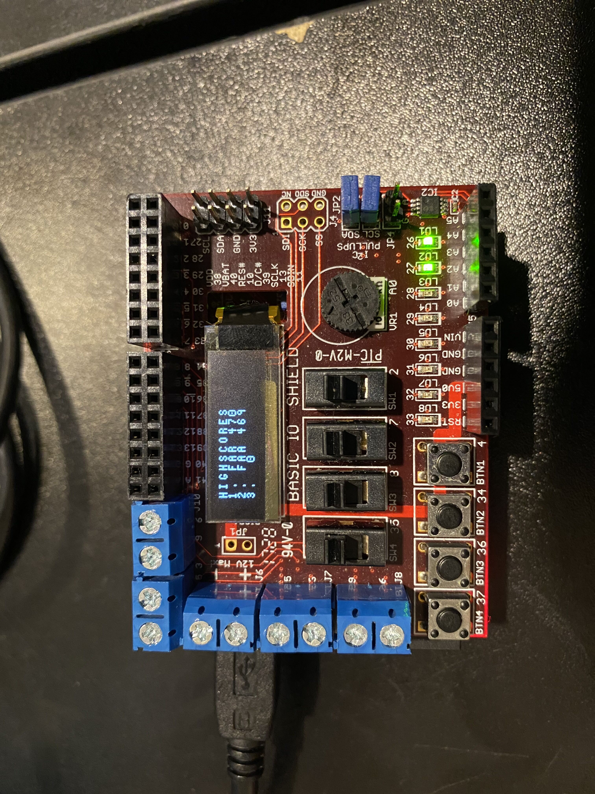

# Super Mario ChipKIT

*This project was developed as a part of the IS1500 course at KTH by Abhinav Sasikumar and Farhan Syed.*

The project is a Super Mario based 2D platformer game. The player can move vertically and horisontally and can jump. The player must make their way past moving enemies and obstacles to make it to the end of the level. The player can also collect coins along the way. If the player dies, they must restart the game. If the player completes all levels, they  can save their highscore by inserting the first 3 letters of their name. Score is calculated using a combination of time taken, lives left, enemies killed, and coins collected. 

The code only works on the Digilent chipKIT Uno32 board when flashing using the the mcb32 compiler.

### Controls

**Move right:** BTN1

**Move left:** BTN2

**Jump:** BTN4

### Some images

#### Title screen

#### Main menu

#### Gamplay

#### Highscores
Insertion of name is not shown :\(

