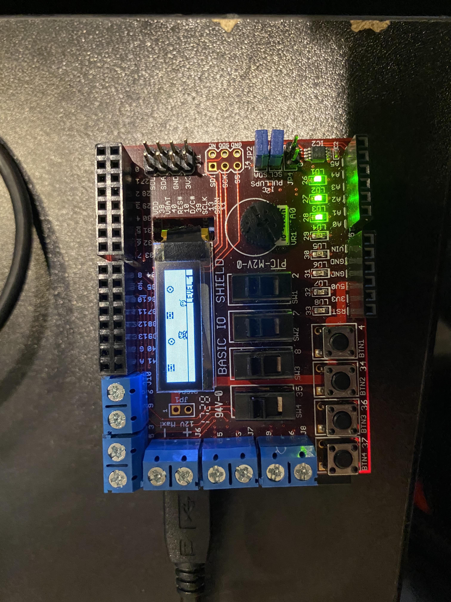

# Super Mario ChipKIT

This project was developed as a part of the IS1500 course at KTH by Abhinav Sasikumar and Farhan Syed.
Super Mario based 2D platformer game. The player must make their way past enemies and obstacles to make it to the end of the level.
The player can also collect coins along the way. If the player dies, they must restart the game. Players can save high scores after they have completed both levels.

The code only works on the Digilent chipKIT uno32 board when flashing using the the mcb32 compiler.

### Some images

#### Title screen

#### Main menu

#### Gamplay

#### Highscores
Insertion of name is not shown :\(

